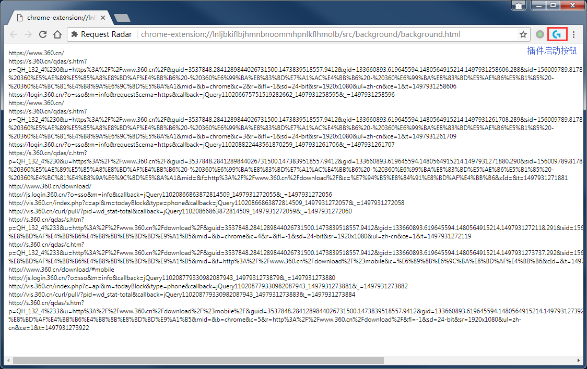

# Request Radar

## 开发资源

### JS 在线美化 

http://www.css88.com/tool/js_beautify/

### JS API 

https://msdn.microsoft.com/zh-cn/library/d1et7k7c(v=vs.94).aspx

### how-do-i-parse-a-url-into-hostname-and-path-in-javascript   

https://stackoverflow.com/questions/736513/how-do-i-parse-a-url-into-hostname-and-path-in-javascript
https://gist.github.com/jlong/2428561

### Chrome插件（Extensions）开发攻略

http://www.cnblogs.com/guogangj/p/3235703.html

### Chrome官方开发文档 

https://developer.chrome.com/extensions

https://developer.chrome.com/extensions/webRequest

## 学习记录

js中，函数也是一种对象。

chrome 的插件（ extensions ）编写和我们所编写的后台程序有些区别，区别在于chrome的插件要基于chrome运行，该插件不能妨碍chrome的正常运行，因此是一种监听式的编程形式。

## 运行截图

